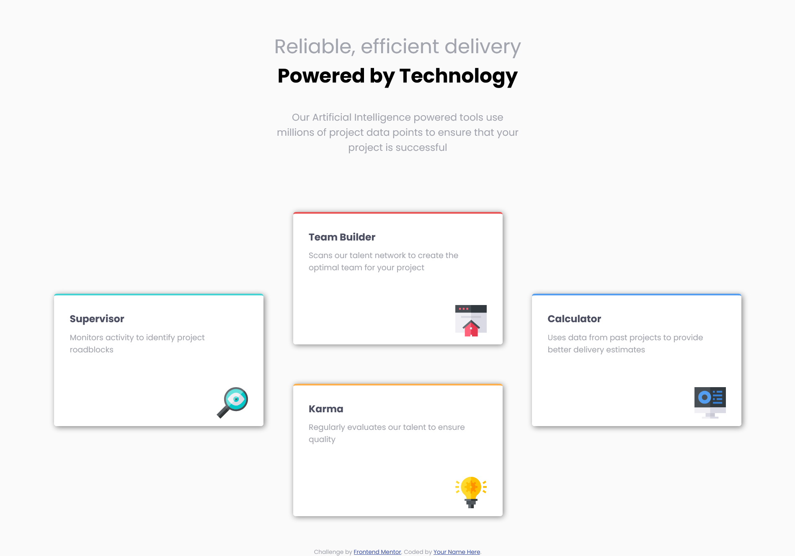

# Frontend Mentor - Four card feature section solution

This is a solution to the [Four card feature section challenge on Frontend Mentor](https://www.frontendmentor.io/challenges/four-card-feature-section-weK1eFYK). Frontend Mentor challenges help you improve your coding skills by building realistic projects. 

## Table of contents

- [Overview](#overview)
  - [The challenge](#the-challenge)
  - [Screenshot](#screenshot)
  - [Links](#links)
- [My process](#my-process)
  - [Built with](#built-with)
  - [What I learned](#what-i-learned)
  - [Continued development](#continued-development)
  - [Useful resources](#useful-resources)
- [Author](#author)

## Overview

### The challenge

Users should be able to:

- View the optimal layout for the site depending on their device's screen size

### Screenshot

### Links

- Solution URL: [Github](https://github.com/yaywonah/Four-Card-Feature-Section)
- Live Site URL: [Github Pages](https://yaywonah.github.io/Four-Card-Feature-Section/)

## My process

### Built with

- Semantic HTML5 markup
- CSS custom properties
- Flexbox
- CSS Grid
- Mobile-first workflow

### What I learned

I finally learned how to use CSS grid! I also learned more about box shadow and how to make only one side of the border visible. I also learned how to usee Flexbox and grid in order to create the cross layout. I also made this without relying on the Figma design files.

### Useful resources

- [Youtube](https://www.youtube.com/watch?v=wxwsEZxa1AI&t=498s&pp=ygUqZnJvbnQgZW5kIG1lbnRvciBmb3VyIGNhcmQgZmVhdHVyZSBzZWN0aW9u) - I got stuck trying to figure out how to arrange the cards because I was only focusing one or the other for CSS grid and flexbox. This video taught me that I can use both.

## Author

- Frontend Mentor - [@yaywonah](https://www.frontendmentor.io/profile/yaywonah)
